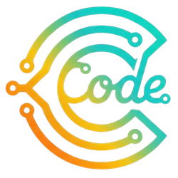

  
   
  
  
<strong>High-Performance Web Solutions for Taiwanese Industries</strong>

  
專為台灣產業打造的高效能靜態網站 | 美甲・傳產・診所・職人

  
   

  
  

 

---

### 🚀 Business Philosophy

We don't just build websites; we engineer **digital assets** that load instantly and convert visitors.

Cedric Studio 採用透明且直觀的報價模式：**「一次性建置費 (Setup Fee)」** 搭配 **「基礎維運費 (Infrastructure Fee)」**。
您無需擔心複雜的授權問題，我們專注於交付極速、安全且高轉換率的數位門面，並確保其 24/7 穩定運行。

### 🛠 Tech Stack & Infrastructure

我們採用現代化 **Jamstack** 技術堆棧，結合靜態生成的極致效能與 **企業級雙備援 (Dual-CDN Strategy)** 部署架構。

| Category | Technologies |
| :--- | :--- |
| **Core Engine** |   |
| **Frontend Experience** |   |
| **Global Deployment** |   |

---

### 🏆 Product Lines

> **Note:** Our source code is hosted in **Private Repositories** to protect our proprietary code and client data.

#### 🎨 Category A: Visual Heavy (高視覺衝擊)
*針對講究美感、作品展示的行業，極致優化圖片加載體驗。*

* **🏠 Interior Design (室內設計):** * 施工前後 (Before/After) 拖曳對比效果。
    * 風格分類畫廊 (北歐/工業/現代) 與視覺化服務流程。
* **📷 Visual Portfolio (影像創作者):** * Masonry 瀑布流佈局，完美展示長短不一的作品。
    * 內建防盜圖機制與客戶專屬私密相簿 (Password Protected)。
* **🛏️ Hospitality (旅宿與體驗):** * 沉浸式房型輪播 (Immersive Carousel)。
    * 整合 Google Maps API 周邊景點導覽與直觀訂房引導。

#### ⚖️ Category B: Trust & Authority (高信任專業)
*針對需要展現專業度、文章內容與 SEO 架構的行業。*

* **🏥 Healthcare (診所/醫療):** * YAML 驅動的醫師輪值表，管理門診時間更靈活。
    * 符合 A11y 無障礙規範，並針對醫療關鍵字優化 SEO 結構。
* **🎓 Education (教育/補教):** * 清晰的課程時間軸與師資陣容卡片。
    * 高轉化率的學員見證區塊 (Testimonials)。
* **🏭 Industrial B2B (傳統產業/工廠):** * **[Flagship Product]** 專為國際貿易設計。
    * 完整產品規格表 (Table)、PDF 型錄下載區、多語系支援 (i18n)。

#### ⚡ Category C: Functional & Niche (功能導向)
*針對特定商業行為或短期活動的高流量解決方案。*

* **🚀 Tech Landing (SaaS/軟體):** * 現代化定價表 (月繳/年繳切換) 與深色模式 (Dark Mode)。
* **🎫 Event & Summit (活動/會議):** * 倒數計時器與按日切換的議程表。
    * 雙備援架構可承受活動報名期間的瞬間高流量爆發 (Zero Downtime)。
* **🤝 NGO & Charity (非營利組織):** * 視覺化募款進度條與組織大事紀 (Timeline)。
    * 極低維護成本，適合預算有限的公益團體。
* **📱 Personal Bio (個人名片):** * Mobile-First 極簡設計，整合社交連結與 vCard QR Code。

---

  
© 2026 Cedric Studio. Built with the Jamstack.

